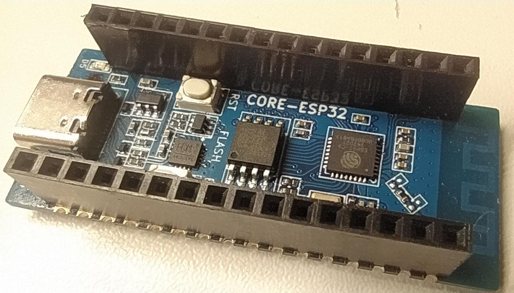

# ESP32-C3 Luatos Air101-LCD Project

Проект для работы с платой **Luatos ESP32-C3** и платой расширения **Air101-LCD** на языке **MicroPython**.

## 🛠️ Оборудование

- **Микроконтроллер:** ESP32-C3 (RISC-V, Wi-Fi + Bluetooth 5)
- **Плата:** Luatos Core ESP32C3
- **Дисплей:** Air101-LCD (ST7735, 80x160 пикселей)
- **Управление:** 5-кнопочный джойстик (Вверх, Вниз, Влево, Вправо, Центр)

## 📌 Распиновка (Pinout)

### 🖥️ Дисплей (ST7735) — SPI 1

| Сигнал | Пин ESP32-C3 | Описание          |
|--------|--------------|-------------------|
| SCK    | GPIO 2       | Тактовая линия    |
| MOSI   | GPIO 3       | Данные            |
| CS     | GPIO 6       | Выбор чипа        |
| DC     | GPIO 10      | Data/Command      |
| RST    | GPIO 7       | Сброс             |

### 🎮 Джойстик (Кнопки)

| Кнопка   | Пин ESP32-C3 | Логика      |
|----------|--------------|-------------|
| UP       | GPIO 13      | Pull-Up     |
| DOWN     | GPIO 8       | Pull-Up     |
| LEFT     | GPIO 9       | Pull-Up     |
| RIGHT    | GPIO 5       | Pull-Up     |
| CENTER   | GPIO 4       | Pull-Up     |

> **Внимание:** Кнопки активны при низком уровне (`0` — нажато, `1` — отпущено).


## 🐍 Программное обеспечение

- **Прошивка:** MicroPython (версия для ESP32-C3)
- **Зависимости:** 
  - `st77352.py` (драйвер дисплея)
  - `sysfont.py` (шрифт)
  - *Файлы драйверов должны быть загружены в память платы.*

## 📸 Фоотографии внешнего вида




## 🖥️ Характеристики дисплея

| Параметр | Значение |
|----------|----------|
| Модель   | ST7735   |
| Разрешение | 80 × 160 пикселей |
| Ориентация | Портретная |
| Поворот  | `rotation(3)` |
| Рабочая область | X: 0-159, Y: 0-79 |

### Схема координат

```text
(0,0) ┌────────────────────────────────────────┐ (159,0)
      │                                        │
      │  Ширина: 160 пикселей                  │
      │                                        │
      │                                        │
      │                                        │
      │                                        │
      │  Высота: 80 пикселей                   │
      │                                        │
      │                                        │
      └────────────────────────────────────────┘
(0,79)                                         (159,79)
```
