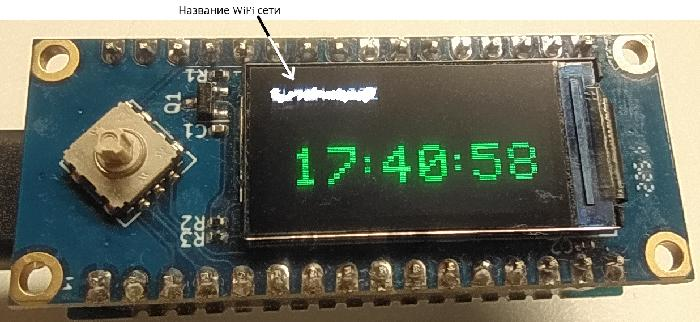

# UTC_time_WiFi

связка LuatOS на базе ESP32c3 и модуля Air101-lcd подключенных один к одному

Перерисовывать весь дисплей каждую секунду очень плохая идея из-за медленности данного процесса, поэтому в данном случае реализово обновление каждой цифры отдельно и тольк при её изменении, это позволяет исключить мерцания значений в неизменяемых цифрах.

## Лицензия

MIT
