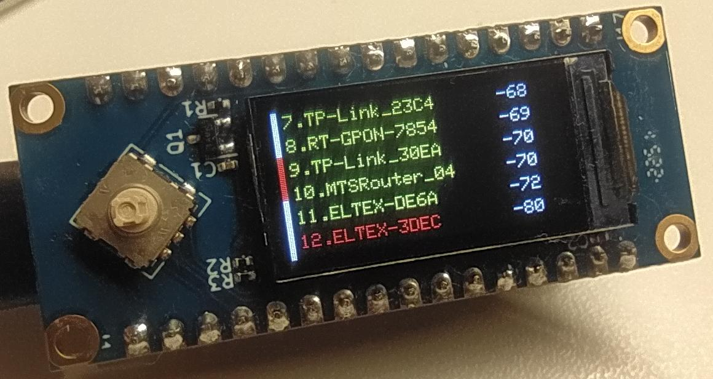

# WiFi_skaner_lcd

связка LuatOS на базе ESP32c3 и модуля Air101-lcd подключенных один к одному

Сканер WiFi сетей с выводом на lcd экран. Вывод осуществляется по 6 строчек. Отображается полоса прокрутки. Использование джостика (вверх/вниз) позволяет прокручивать список найденых сетей, кнопка (центер) запускает новое сканирование. Цвет названия сети зависит от мощности сигнала. Использованы зеленый, желтый и красный цвета.

## Лицензия

MIT
