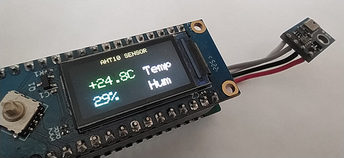

# 🌡️ AHT10 для LuatOS (ESP32-C3 / Air101)

Чтение данных с датчика температуры и влажности AHT10 с выводом результатов на TFT-дисплей ST7735.

## Описание

Программа считывает данные о температуре и влажности с датчика AHT10 через шину I2C и отображает их на TFT-дисплее. 

## Оборудование

- **Микроконтроллер:** ESP32-C3 / Air101 (LuatOS)
- **Дисплей:** TFT ST7735 (80x160)
- **Датчик:** AHT10/AHT20 (температура и влажность)

## 🔧 Подключение

На процессоре нет специально выделенных пинов, отвечающих за I2C. В документации указано, что могут быть использованы любые пины, но с некоторыми ограничениями. Я решил использовать GPIO 0 и GPIO 1, так как они ещё не были заняты.

| Сигнал | GPIO |
|--------|------|
| I2C SCL | GPIO 0 |
| I2C SDA | GPIO 1 |
| SPI SCK | GPIO 2 |
| SPI MOSI | GPIO 3 |
| TFT CS | GPIO 6 |
| TFT DC | GPIO 10 |
| TFT RST | GPIO 7 |
| Кнопка UP | GPIO 13 |
| Кнопка DOWN | GPIO 8 |
| Кнопка CENTER | GPIO 4 |



## Функционал

- **Чтение температуры** в реальном времени
- **Чтение влажности** в реальном времени
- **Вывод данных** на TFT-дисплей
- **Обновление показаний** по таймеру

Реализован вывод только изменяемых значений, что уменьшает мерцания медленного дисплея.

## 🎨 Цветовая индикация

| Параметр | Значение |
|--------|----------|
| Температура ≥ 0°C | 🟢 Зелёный (GREEN) |
| Температура < 0°C | 🔵 Синий (BLUE) |
| Влажность | 🔷 Cyan |
| Подписи Temp/Hum | ⚪ Белый |

## 📁 Структура проекта

```text
aht10/
├── aht_test.py       # Основной скрипт
├── aht10.py          # Драйвер датчика AHT10
├── st77352.py        # Драйвер дисплея ST7735
└── sysfont.py        # Системный шрифт 5x8
```

## Использование

1. Загрузите файлы на устройство
2. Запустите `aht_test.py`
3. Данные с датчика отобразятся на экране
4. Логи дублируются в UART (консоль)

## Адрес устройства

| Адрес | Устройство |
|-------|------------|
| 0x38 | AHT10/AHT20 |

## Лицензия

MIT
