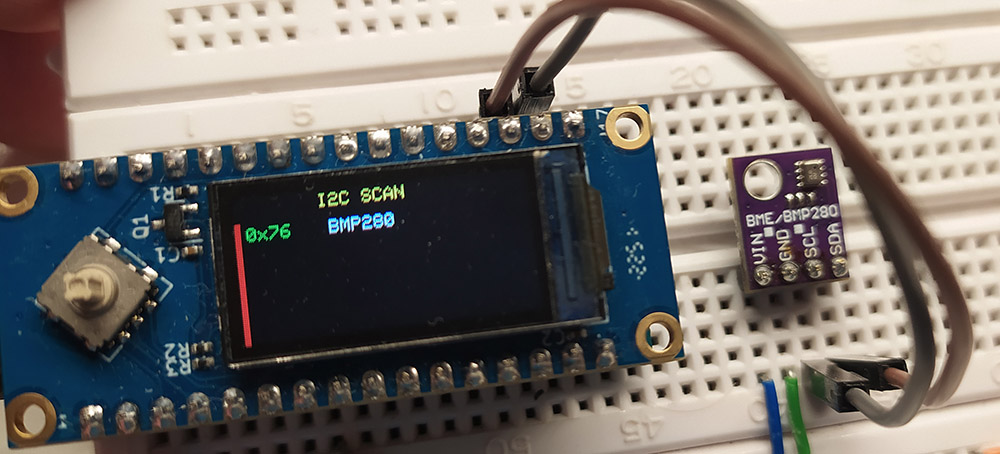
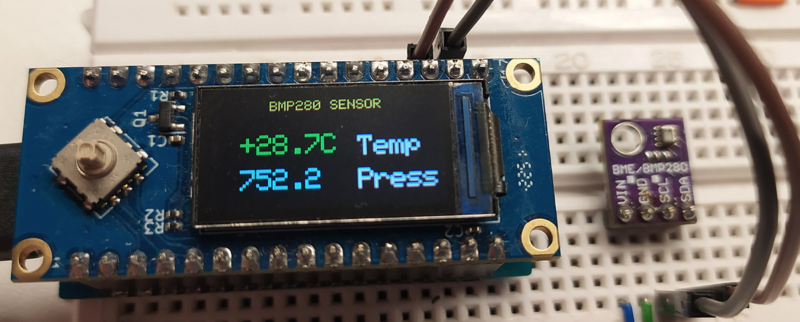

# 🌡️ Датчик BMP280 для LuatOS (ESP32-C3 / Air101)

Чтение данных с датчика BMP280 (температура, давление) с выводом результатов на TFT-дисплей ST7735.

## Описание

Программа считывает данные о температуре и атмосферном давлении с датчика BMP280, отображая значения на TFT-дисплее. Давление выводится в мм рт. ст., температура — в градусах Цельсия с указанием знака (+/-).

## Оборудование

- **Микроконтроллер:** ESP32-C3 / Air101 (LuatOS)
- **Дисплей:** TFT ST7735 (80x160)
- **Датчик:** BMP280 (I2C)

## 🔧 Подключение

| Сигнал | GPIO |
|--------|------|
| I2C SCL | GPIO 0 |
| I2C SDA | GPIO 1 |
| SPI SCK | GPIO 2 |
| SPI MOSI | GPIO 3 |
| TFT CS | GPIO 6 |
| TFT DC | GPIO 10 |
| TFT RST | GPIO 7 |





## Функционал

- **Чтение температуры** с датчика BMP280 (°C)
- **Чтение давления** (hPa и мм рт. ст.)
- **Вывод данных** на TFT-дисплей
- **Цветовая индикация температуры** (зелёный — положительная, синий — отрицательная)
- **Обработка ошибок** при отсутствии датчика
- **Автоматическое определение адреса** (0x76 или 0x77)

## 🎨 Цветовая индикация

| Элемент | Значение |
|--------|----------|
| Температура >= 0°C | 🟢 Зелёный (GREEN) |
| Температура < 0°C | 🔵 Синий (BLUE) |
| Давление | 🩵 Голубой (CYAN) |
| Заголовок | 🟡 Жёлтый (YELLOW) |
| Ошибка датчика | 🔴 Красный (RED) |
| Подписи | ⚪ Белый (WHITE) |

## 📁 Структура проекта

```text
bmp280/
├── bmp280_test.py      # Основной скрипт
├── bmp280.py           # Драйвер датчика BMP280
├── st77352.py          # Драйвер дисплея ST7735
├── sysfont.py          # Системный шрифт
├── IMG_20260403_200219.jpg  # Фото проекта (вид 1)
└── IMG_20260403_203224.jpg  # Фото проекта (вид 2)
```

## Использование

1. Загрузите файлы на устройство
2. Запустите `bmp280_test.py`
3. Наблюдайте показания температуры и давления на экране
4. Логи дублируются в UART (консоль)

## ⚙️ Настройки датчика

- **I2C частота:** 400 кГц
- **Адрес датчика:** 0x76 или 0x77 (автоопределение)
- **Режим работы:** Normal mode
- **Период обновления:** 2 секунды
- **Единицы давления:** мм рт. ст. (0.750062 × hPa)

## 📊 Принцип работы

Датчик BMP280 подключается по шине I2C и измеряет температуру и атмосферное давление. Данные считываются каждые 2 секунды и отображаются на TFT-дисплее. Перерисовка на экране осуществляется только изменяющихся значений, что исключает паразитные мерцания медленного экрана. При отсутствии датчика выводится сообщение об ошибке.

## Лицензия

MIT
