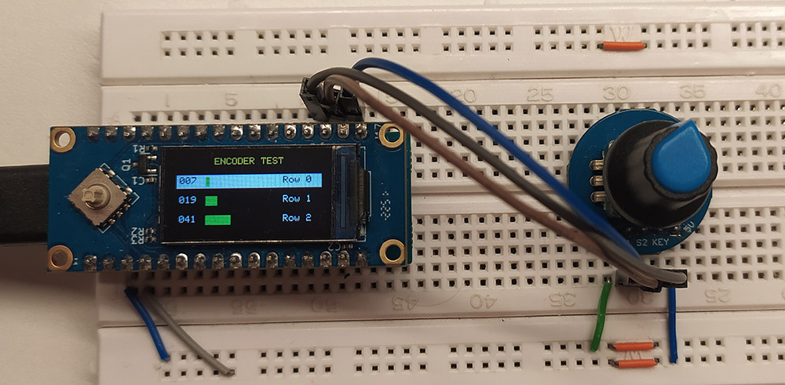

# 🔄 Поворотный энкодер для LuatOS (ESP32-C3 / Air101)

Чтение данных с поворотного энкодера с выводом результатов на TFT-дисплей ST7735.

## Описание

Программа считывает данные о вращении и нажатии кнопки поворотного энкодера, отображая значения на TFT-дисплее. Позволяет изменять значение нескольких полос заполнения с помощью вращения энкодера и переключения между этими строками - кнопкой энкодера.

## Оборудование

- **Микроконтроллер:** ESP32-C3 / Air101 (LuatOS)
- **Дисплей:** TFT ST7735 (80x160)
- **Энкодер:** Поворотный энкодер с кнопкой (KY-040 или аналог)

## 🔧 Подключение

| Сигнал | GPIO |
|--------|------|
| DT | GPIO 0 |
| CLK | GPIO 1 |
| SW (кнопка) | GPIO 12 |
| SPI SCK | GPIO 2 |
| SPI MOSI | GPIO 3 |
| TFT CS | GPIO 6 |
| TFT DC | GPIO 10 |
| TFT RST | GPIO 7 |



## Функционал

- **Чтение вращения** энкодера (влево/вправо)
- **Чтение нажатия** кнопки энкодера
- **Вывод данных** на TFT-дисплей в виде полос прокрутки
- **Переключение между строками** нажатием кнопки энкодера
- **Изменение значений** вращением энкодера (0..100)

## 🎨 Цветовая индикация

| Элемент | Значение |
|--------|----------|
| Активная строка | ⬜ Белый фон, чёрный текст |
| Неактивная строка | ⬛ Чёрный фон, белый текст |
| Полоса заполнения | 🟢 Зелёный (GREEN) |
| Заголовок | 🟡 Жёлтый (YELLOW) |

## 📁 Структура проекта

```text
encoder/
├── encoder_test.py   # Основной скрипт
├── encoder.py        # Драйвер поворотного энкодера
└── ekran.jpg         # Скриншот интерфейса
```

## Использование

1. Загрузите файлы на устройство
2. Запустите `encoder_test.py`
3. Вращайте энкодер для изменения значений
4. Нажимайте кнопку для переключения между строками
5. Логи дублируются в UART (консоль)

## ⚙️ Настройки энкодера

- **rotation_delay:** 1 мс — максимальная чувствительность вращения
- **debounce:** 50 мс — защита от дребезга кнопки
- **Диапазон значений:** 0..100
- **Количество строк:** 3

## 📊 Принцип работы

Энкодер генерирует импульсы на выводах DT и CLK со сдвигом фазы, по которому определяется направление вращения. Кнопка SW активируется при нажатии. Перерисовка на экране осуществляется только изменяющихся значений, что исключает парозитные мерцания медленного экрана.

## Лицензия

MIT
