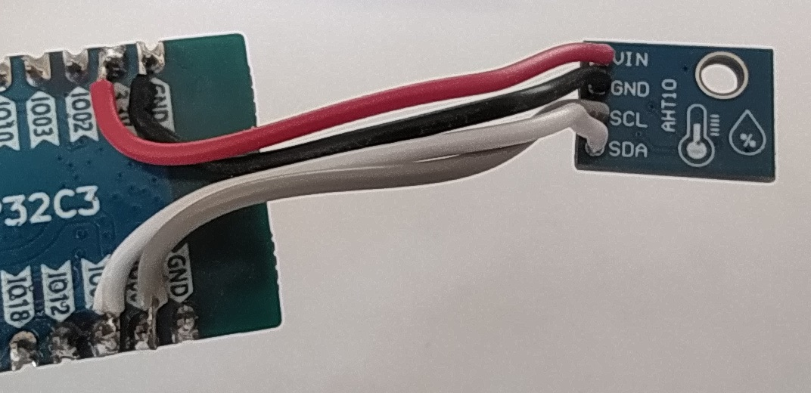

# I2C Scanner для LuatOS (ESP32-C3 / Air101)

Сканер I2C-устройств с выводом результатов на TFT-дисплей ST7735.

## Описание

Программа сканирует шину I2C в диапазоне адресов `0x00-0x7F`, обнаруживает подключённые устройства и отображает их на дисплее. Поддерживается навигация по списку найденных устройств с помощью джойстика.

## Оборудование

- **Микроконтроллер:** ESP32-C3 / Air101 (LuatOS)
- **Дисплей:** TFT ST7735 (80x160)
- **I2C устройства:** любые (OLED, датчики, EEPROM и др.)

## Подключение

На процессоре нет специально выделенных пинов, отвечающих за I2C. В документации указано, что могут быть использованы любые пины, но с некоторыми ограничениями. Я решил использовать GPIO 0 и GPIO 1, так как они ещё не были заняты.

| Сигнал | GPIO |
|--------|------|
| I2C SCL | GPIO 0 |
| I2C SDA | GPIO 1 |
| SPI SCK | GPIO 2 |
| SPI MOSI | GPIO 3 |
| TFT CS | GPIO 6 |
| TFT DC | GPIO 10 |
| TFT RST | GPIO 7 |
| Кнопка UP | GPIO 13 |
| Кнопка DOWN | GPIO 8 |
| Кнопка CENTER | GPIO 4 |



## Функционал

- **Автоматическое сканирование** при запуске
- **Распознавание устройств** по известным адресам:
  - `0x3C/0x3D` — OLED дисплеи
  - `0x68` — DS3231 (RTC)
  - `0x76/0x77` — BMP280
  - `0x44` — SHT30
  - `0x50-0x53` — EEPROM
  - и другие
- **Прокрутка списка** джойстиком UP/DOWN (по 5 устройств)
- **Повторное сканирование** кнопкой джойстика CENTER

## Управление

| Джойстик | Действие |
|--------|----------|
| UP | Прокрутка вверх |
| DOWN | Прокрутка вниз |
| CENTER | Пересканировать шину |

## Структура проекта

```text
i2c_scanner/
├── i2c_scanner.py    # Основной скрипт
├── st77352.py        # Драйвер дисплея ST7735
└── sysfont.py        # Системный шрифт 5x8
```

## Использование

1. Загрузите файлы на устройство
2. Запустите `i2c_scanner.py`
3. Результаты сканирования отобразятся на экране
4. Логи дублируются в UART (консоль)

## Известные адреса устройств

| Адрес | Устройство |
|-------|------------|
| 0x38 | AHT10/20 |
| 0x39 | TSL2561 |
| 0x3C | OLED 0.96" |
| 0x3D | OLED 1.3" |
| 0x40 | SI7021 |
| 0x44 | SHT30 |
| 0x50-0x53 | EEPROM |
| 0x68 | DS3231 |
| 0x69 | MPU6050 |
| 0x76/0x77 | BMP280 |
| 0x7D | LD2410 |

## Лицензия

MIT
