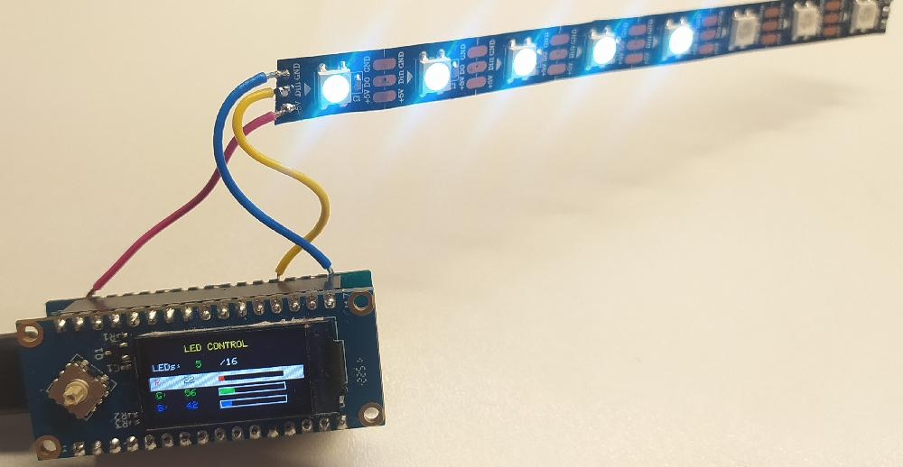

# RGB LED WS2812B

Проект для управления RGB LED лентой (NeoPixel/WS2812) в связке с LuatOS на базе ESP32c3 и модулем Air101-lcd подключенных один к одному.

## Описание

Программа позволяет управлять параметрами RGB-ленты (ограничено 16 светодиодами) по средствам джойстика:

- Выбор количества активных светодиодов (1-16)
- Настройка интенсивности красного (R), зелёного (G) и синего (B) каналов (0-255)

## Аппаратные требования

- **Микроконтроллер**: LuatOS (ESP32c3) + Air101
- **Дисплей**: ST7735S 80x160 (на плате Air101)
- **LED лента**: NeoPixel/WS2812 (16 светодиодов)
- **Джойстик**: 5 кнопок (UP, DOWN, LEFT, RIGHT, CENTER) (на плате Air101)

## Подключение пинов

| Компонент | Пин | GPIO |
|-----------|-----|------|

| **NeoPixel** | Pin 12 | GPIO12 |

## Управление

| Кнопка | Действие |
|--------|----------|
| **UP** / **DOWN** | Перемещение по меню |
| **LEFT** / **RIGHT** | Изменение значения  |

- кратное воздействие на **LEFT** / **RIGHT** - изменяет значение на 1 
- удержание **LEFT** / **RIGHT** - периодически изменяет значение на 10 

## Структура файлов

- `rgb_led.py` — основной скрипт управления
- `st77352.py` — драйвер дисплея ST7735S (поддержка различных модификаций)

## Настройки

В начале файла `rgb_led.py` можно изменить параметры:

```python
num_leds = 8          # Начальное количество активных LED
color_r = 128         # Начальная интенсивность красного
color_g = 128         # Начальная интенсивность зелёного
color_b = 128         # Начальная интенсивность синего
```

## Требования к зависимостям

- `machine` — доступ к GPIO и SPI
- `neopixel` — управление NeoPixel LED
- `utime` — задержки и таймеры
- `sysfont` — системный шрифт для отображения текста

## 📺 Интерфейс

```text
┌──────────────────────────────────────────────┐
│              LED CONTROL                     │  ← Жёлтый заголовок
├──────────────────────────────────────────────┤
│ LEDs: 8/16                                   │  ← Строка 0
├──────────────────────────────────────────────┤
│ R: 128 [████████░░░░░░░░░░░░]                │  ← Строка 1 (R: красный)
├──────────────────────────────────────────────┤
│ G: 128 [████████░░░░░░░░░░░░]                │  ← Строка 2 (G: зелёный)
├──────────────────────────────────────────────┤
│ B: 128 [████████░░░░░░░░░░░░]                │  ← Строка 3 (B: синий)
└──────────────────────────────────────────────┘
```

