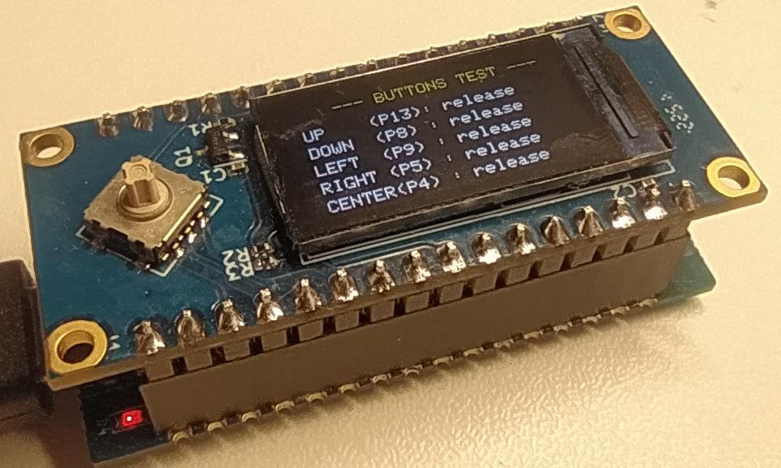
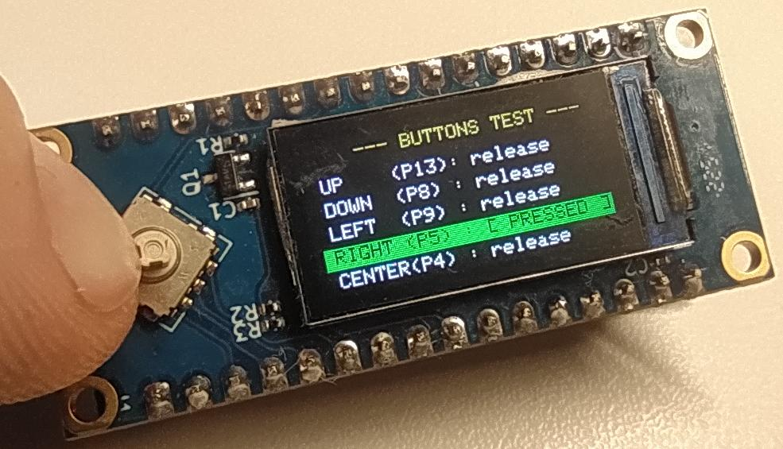

# test_joystick_lcd

связка LuatOS на базе ESP32c3 и модуля Air101-lcd подключенных один к одному



```python
# --- Кнопки ---
up_key     = Pin(13, Pin.IN, Pin.PULL_UP)
down_key   = Pin(8,  Pin.IN, Pin.PULL_UP)
left_key   = Pin(9,  Pin.IN, Pin.PULL_UP)
right_key  = Pin(5,  Pin.IN, Pin.PULL_UP)
center_key = Pin(4,  Pin.IN, Pin.PULL_UP)
```


